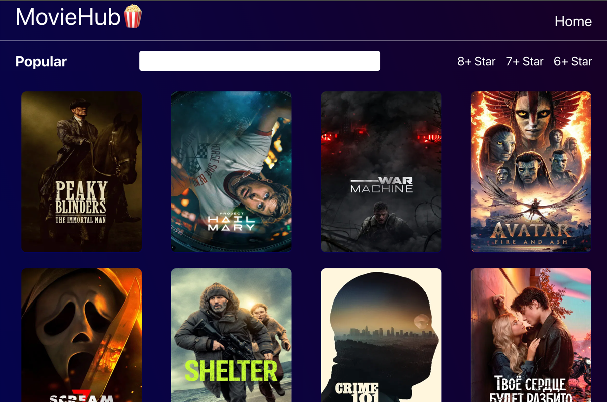
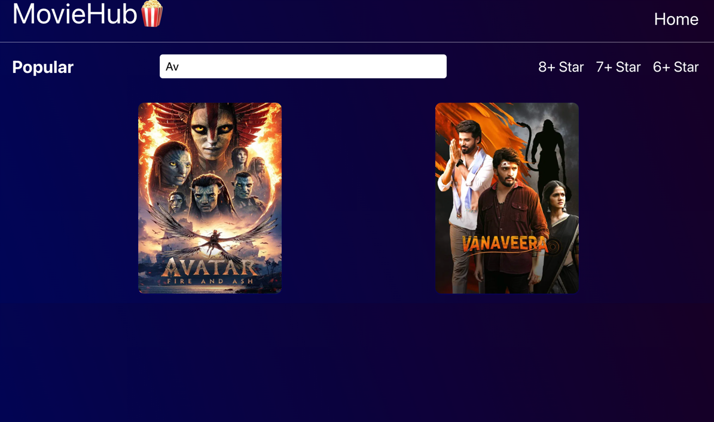

# 🎬 Movie Search App

A simple React application that allows users to search for movies and view detailed information about them.

## 🚀 Features

- 🔍 Search movies by title
- 🎞 Display movie list with posters
- 📄 View detailed movie information
- ⏳ Loading state while fetching data
- 📱 Responsive design (mobile-friendly)

## 🛠 Technologies Used

- React
- React Router DOM
- JavaScript (ES6+)
- CSS
- Fetch API

## 🌐 API

This project uses the OMDb API:
https://api.themoviedb

## 📂 Project Structure

src
├ components
│ ├ Navbar.jsx
│ ├ MovieCard.jsx
    ├ MovieList.jsx
│ └ Loader.jsx
│
│
├ App.jsx
└ index.js

## ⚙️ Installation

1. Clone the repository:

git clone https://github.com/dariyapl/movie-app.git

2. Navigate to the project folder:

cd movie-app

3. Install dependencies:

npm install

4. Start the development server:

npm start

---

## 📸 Screenshots

---

## 💡 Future Improvements

- ⭐ Add favorites (localStorage)
- 📄 Pagination
- 🌙 Dark mode
- 🎯 Filter by year/type
- 🔐 Authentication (optional)

---

## 👩‍💻 Author

Created by **Dariya Polova**

---

## ⭐ Notes

This project was built as part of a frontend learning journey to practice React, API integration.